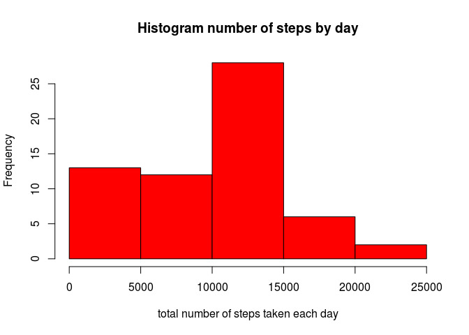
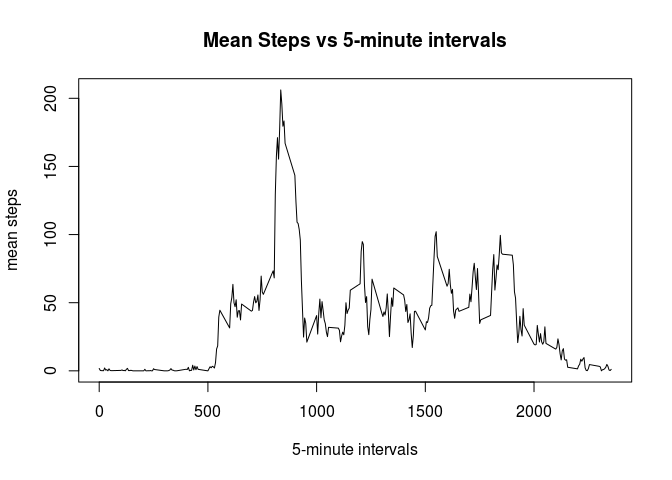
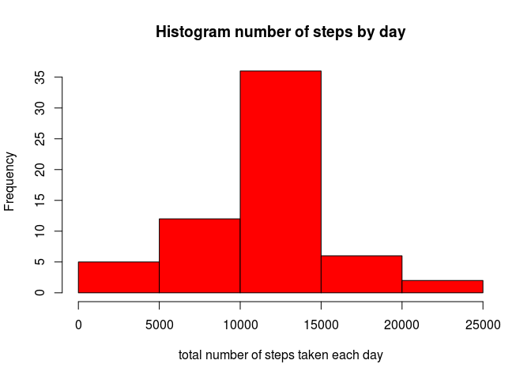
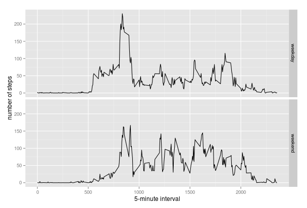

# Reproducible Research: Personal Activity Monitoring
anroco  


## Loading and preprocessing the data

The Activity monitoring data contained in the file activity.csv that found in the zip file can be loaded using the following code:


```r
activity_data <- read.csv(unz("activity.zip", "activity.csv"), nrows = 17568,
                            colClasses = c("numeric", "Date", "numeric"))
summary(activity_data)
```

```
##      steps             date               interval     
##  Min.   :  0.00   Min.   :2012-10-01   Min.   :   0.0  
##  1st Qu.:  0.00   1st Qu.:2012-10-16   1st Qu.: 588.8  
##  Median :  0.00   Median :2012-10-31   Median :1177.5  
##  Mean   : 37.38   Mean   :2012-10-31   Mean   :1177.5  
##  3rd Qu.: 12.00   3rd Qu.:2012-11-15   3rd Qu.:1766.2  
##  Max.   :806.00   Max.   :2012-11-30   Max.   :2355.0  
##  NA's   :2304
```

## What is mean total number of steps taken per day?

The total number of steps per day is calculated, and a histogram of the total number of steps taken each day is created


```r
steps_day <- tapply(activity_data$steps, activity_data$date, sum, na.rm = T)
hist(steps_day,  xlab="total number of steps taken each day", col="red", 
                            main="Histogram number of steps by day")
```

 

The mean and median of the total number of steps taken per day.


```r
mean(steps_day, na.rm=TRUE)
```

```
## [1] 9354.23
```

```r
median(steps_day, na.rm=TRUE)
```

```
## [1] 10395
```

## What is the average daily activity pattern?

Plot of the 5-minute interval vs. the average number of steps taken, averaged across all days.


```r
steps_interval <- tapply(activity_data$steps, activity_data$interval, mean, na.rm = T)
plot(names(steps_interval), steps_interval, type= "l", ylab="mean steps", 
     xlab= "5-minute intervals", main="Mean Steps vs 5-minute intervals")
```

 

Obtain the 5-minute interval containing the maximum number of steps.


```r
max_interval <- which.max(steps_interval)
names(max_interval)
```

```
## [1] "835"
```

## Imputing missing values

Determining the total number of missing values (NA).


```r
sum(is.na(activity_data$steps))
```

```
## [1] 2304
```

Filling in all of the missing values in the activity_data dataset with the mean for that 5-minute interval specific.


```r
data_fill_NA <- activity_data
for(i in 1:nrow(data_fill_NA)){
    if(is.na(data_fill_NA$steps[i]))
        data_fill_NA$steps[i]<- steps_interval[as.character(data_fill_NA$interval[i])]
}
```

It can be seen that there is already missing values (NA) in the new dataset.


```r
sum(is.na(data_fill_NA$steps))
```

```
## [1] 0
```

Calculate and report the mean and median total number of steps taken per day with respect to the new dataset obtained in the previous step.


```r
steps_day_2 <- tapply(data_fill_NA$steps, data_fill_NA$date, sum, na.rm = T)
hist(steps_day_2,  xlab="total number of steps taken each day", col="red", 
     main="Histogram number of steps by day")
```

 

```r
mean(steps_day_2, na.rm=TRUE)
```

```
## [1] 10766.19
```

```r
median(steps_day_2, na.rm=TRUE)
```

```
## [1] 10766.19
```

After replacing the missing data, the values of mean and median are higher than in the previous case.

## Are there differences in activity patterns between weekdays and weekends?

Define whether a given date is a weekday or weekend day.


```r
data_fill_NA$day <- sapply(data_fill_NA$date, 
                           function(date){
                                day <- weekdays(date)
                                if (day %in% c("Monday", "Tuesday", "Wednesday", "Thursday", "Friday"))
                                    return("weekday")
                                else (day %in% c("Saturday", "Sunday"))
                                    return("weekend")
                            })
```

Plot of the 5-minute interval vs the average number of steps taken, across all weekday days or weekend days.


```r
library(ggplot2)
averages <- aggregate(steps ~ interval + day, data_fill_NA, mean)
ggplot(averages, aes(interval, steps)) + geom_line() + facet_grid(day ~ .) + xlab("5-minute interval") + ylab("number of steps")
```

 
